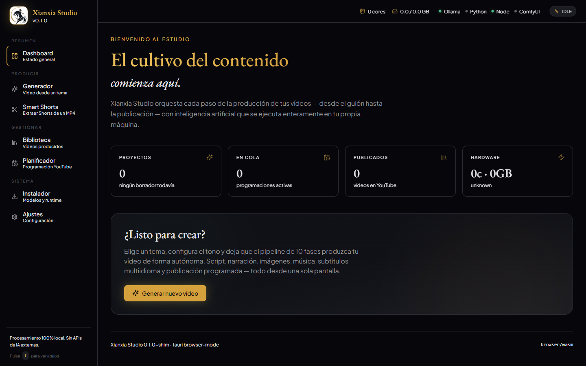
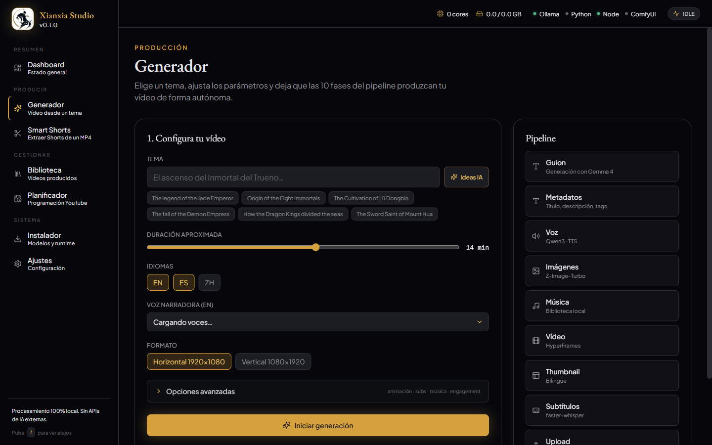
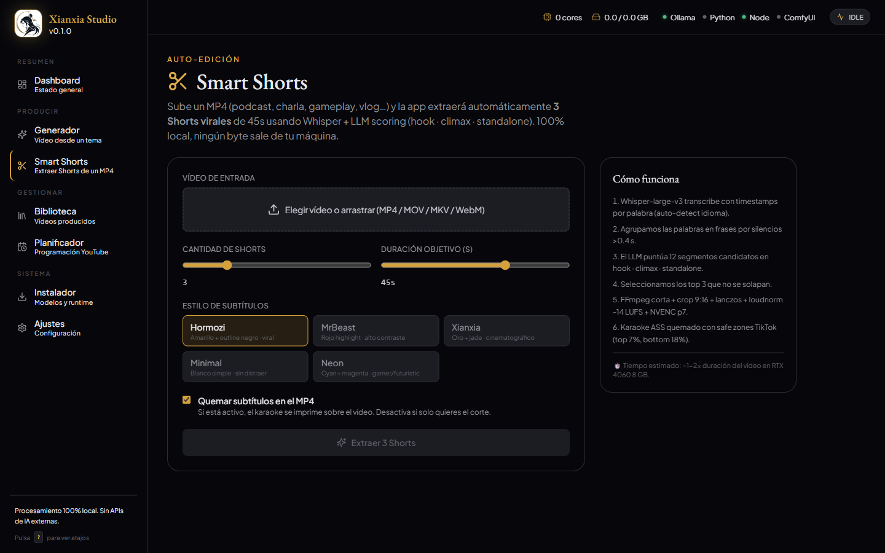
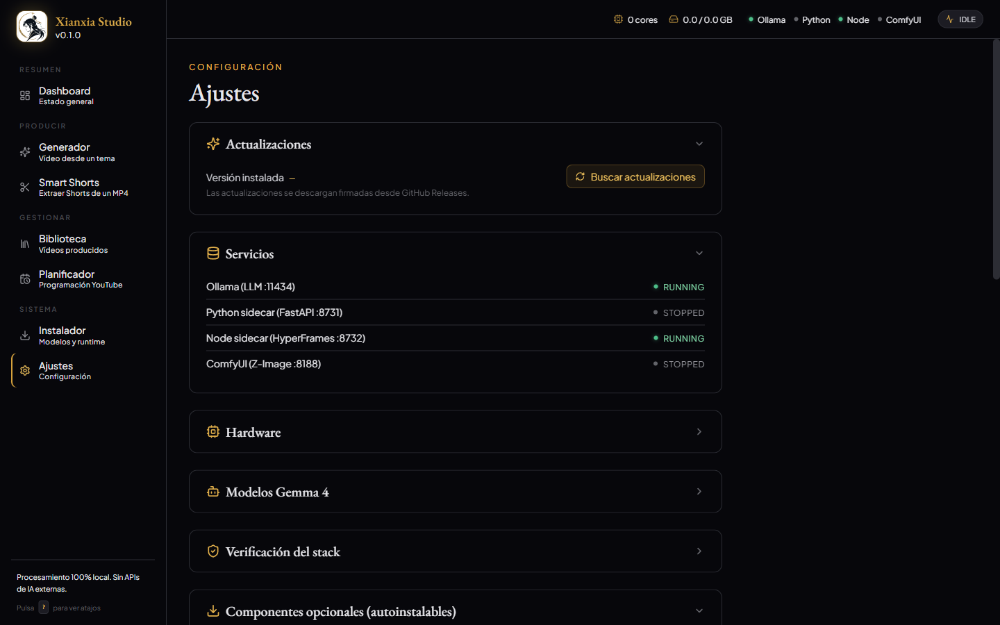

<div align="center">


<br/>
<br/>

[](LICENSE)
[](https://github.com/SwonDev/Xianxia_Studio/releases/latest)
[](https://github.com/SwonDev/Xianxia_Studio/stargazers)
[](https://ko-fi.com/swonproject)

### **Studio cinematográfico de IA local · 100 % offline · Apache 2.0**

<a href="https://github.com/SwonDev/Xianxia_Studio/releases/latest">&nbsp;&nbsp;<b>Descargar para Windows</b></a>
&nbsp;·&nbsp;
<a href="https://ko-fi.com/swonproject">&nbsp;&nbsp;<b>Invítame a un café</b></a>
&nbsp;·&nbsp;
<a href="https://github.com/SwonDev/Xianxia_Studio/issues/new/choose">&nbsp;&nbsp;<b>Reportar un bug</b></a>

</div>

<br/>

---

## Lo que hace

Escribes un tema. La aplicación entrega un **vídeo cinematográfico listo para subir a YouTube** — guion narrativo, voz, imágenes, banda sonora, montaje con efectos, subtítulos quemados, miniatura y subida programada.

Todo el procesamiento de IA ocurre **en tu propio equipo**. Sin enviar nada a la nube. Sin claves API. Sin cuotas mensuales. Sin que tus ideas pasen por servidores ajenos.

Pensada para creadores que producen contenido sobre mitología china, *xianxia* y *wuxia*, pero útil para cualquier nicho narrativo.

<br/>

## Echa un vistazo

<table>
  <tr>
    <td width="50%" align="center">
      
      <br/><sub><b>Dashboard</b> · estado del estudio en una sola pantalla</sub>
    </td>
    <td width="50%" align="center">
      
      <br/><sub><b>Generador</b> · un tema, 10 fases, un vídeo listo</sub>
    </td>
  </tr>
  <tr>
    <td width="50%" align="center">
      
      <br/><sub><b>Smart Shorts</b> · extrae clips virales de cualquier MP4</sub>
    </td>
    <td width="50%" align="center">
      
      <br/><sub><b>Ajustes</b> · servicios, hardware, componentes opcionales</sub>
    </td>
  </tr>
</table>

<br/>

## Lo que incluye

<table>
  <tr>
    <td width="48" align="center"></td>
    <td><b>Long-form y Shorts</b> — 30 s, 5 min o 30 min en horizontal o vertical, calidad cinematográfica nativa.</td>
  </tr>
  <tr>
    <td align="center"></td>
    <td><b>Smart Shorts</b> — extrae fragmentos virales de un MP4 ya editado, igual que OpusClip pero local.</td>
  </tr>
  <tr>
    <td align="center"></td>
    <td><b>Voz nativa</b> — 9 voces multilenguaje + clónala con 5 segundos de tu propio audio.</td>
  </tr>
  <tr>
    <td align="center"></td>
    <td><b>Engagement con neurociencia</b> — detecta valles aburridos con TRIBE v2 (modelo fMRI de Meta) y los corrige automáticamente.</td>
  </tr>
  <tr>
    <td align="center"></td>
    <td><b>5 estilos de subtítulos</b> — desde el cinematográfico al estilo MrBeast, con karaoke palabra a palabra.</td>
  </tr>
  <tr>
    <td align="center"></td>
    <td><b>Edición automática</b> — HyperFrames compone HTML/CSS/GSAP con parallax 2.5D, partículas atmosféricas, transiciones cinemáticas.</td>
  </tr>
  <tr>
    <td align="center"></td>
    <td><b>9 presets de exportación</b> — YouTube, IG Reels, TikTok, X, FB con loudness optimizado para cada plataforma.</td>
  </tr>
  <tr>
    <td align="center"></td>
    <td><b>Subida a YouTube</b> — programada, con metadata, captions multi-idioma y thumbnail automáticos.</td>
  </tr>
  <tr>
    <td align="center"></td>
    <td><b>Auto-update firmado</b> — las nuevas versiones llegan solas, verificadas criptográficamente.</td>
  </tr>
</table>

<br/>

## Descargar

> **Windows 11 · NVIDIA RTX 4060 (8 GB VRAM) o superior · 30 GB libres**

[**Última release**](https://github.com/SwonDev/Xianxia_Studio/releases/latest) → elige el `Xianxia_Studio_X.Y.Z_x64-setup.exe` (NSIS, recomendado para uso individual) o el `.msi` (si prefieres instalación silenciosa).

La primera vez que abras la app, un wizard descarga modelos y runtimes (~10 GB obligatorios + ~20 GB opcionales). El stack está optimizado para **8 GB de VRAM**: GGUF cuantizado, offload secuencial, todo cabe sin pelear.

> El instalador no tiene firma Authenticode comercial todavía, así que la primera ejecución muestra "Editor desconocido" en SmartScreen. Pulsa **Más información → Ejecutar de todas formas**. Las actualizaciones posteriores se aplican sin diálogos porque van firmadas con la clave de updater.

<br/>

## Apoya el proyecto

Xianxia Studio es **gratis y open source**. Si te ahorra horas de edición y quieres ayudar a que siga creciendo, puedes invitar a un café:

<div align="center">
  <br/>
  <a href="https://ko-fi.com/swonproject">
    
  </a>
  <br/><br/>
  <b><a href="https://ko-fi.com/swonproject">ko-fi.com/swonproject</a></b>
</div>

<br/>

Cada apoyo va directo a:

- Sostener el desarrollo y la documentación.
- Probar nuevos modelos a medida que aparecen.
- Mantener la app 100 % gratuita y sin tracking.

<br/>

## Bajo el capó

<details>
<summary><b>Pulsa para ver la stack técnica completa</b></summary>

<br/>

| Capa | Tecnología |
|---|---|
| Desktop shell | Tauri 2 · Rust · React 19 · Vite · Tailwind 4 · TanStack Router |
| LLM | Ollama + Gemma 4 abliterated GGUF Q4_K_M |
| TTS | Qwen3-TTS-12Hz-1.7B-CustomVoice (9 voces + cloning) |
| ASR | faster-whisper-large-v3 (timestamps por palabra) |
| Imagen | ComfyUI + Z-Image-Turbo Q4_K_M GGUF |
| Visión 2.5D | rembg · onnxruntime-gpu · MediaPipe · YOLO11n-pose |
| Música | MusicGen-medium fp16 GPU-only · librería local (fallback) |
| **Vídeo · motor** | **[HyperFrames](https://github.com/heygen-com/hyperframes)** — HTML/CSS/GSAP → MP4 con parallax + atmospherics + transiciones |
| Vídeo · post | FFmpeg 8 con NVENC h264, grade cinemático, sidechain ducking |
| Engagement | Meta TRIBE v2 (fMRI) + Yeo 7-network atlas |
| Subida | YouTube Data v3 + OAuth RFC 8252 |
| Orquestación | Tauri Supervisor · Python sidecar (FastAPI) · Node sidecar HyperFrames (Fastify) |

**Filosofía AUTO**: cada modelo, dependencia y backend que toca el pipeline es **autoinstalable** desde la app, **autodetectable** y **autoconfigurable**. Cero comandos en terminal.

</details>

<br/>

## Compilar desde fuente

```bash
git clone https://github.com/SwonDev/Xianxia_Studio.git
cd Xianxia_Studio
pnpm install
pnpm tauri:dev      # arranca en modo desarrollo
pnpm tauri:build    # produce el bundle NSIS + MSI
```

Requisitos: Node 22+, pnpm 10+, Rust stable, Visual Studio Build Tools.

Más detalle operativo: [`CONTRIBUTING.md`](CONTRIBUTING.md) · [`RELEASING.md`](RELEASING.md).

<br/>

## Contribuir

Issues, PRs y feedback bienvenidos. Lee [`CONTRIBUTING.md`](CONTRIBUTING.md) antes de un PR grande. Vulnerabilidades: [`SECURITY.md`](SECURITY.md).

<br/>

## Licencia

[Apache 2.0](LICENSE). Eres libre de usar, modificar, redistribuir y **monetizar comercialmente los vídeos generados**.

Componentes opcionales con licencia distinta: Meta TRIBE v2 está bajo CC-BY-NC-4.0 — su instalación es opcional y los vídeos producidos pueden monetizarse en YouTube si el uso de la aplicación es personal o no comercial respecto al software.

<br/>

---

<div align="center">

Hecho con cuidado por <a href="https://github.com/SwonDev"><b>@SwonDev</b></a> &nbsp;·&nbsp; <a href="https://ko-fi.com/swonproject"><b>Ko-Fi</b></a>

<sub>El logo, el banner y el nombre Xianxia Studio están bajo Apache 2.0 junto al resto del código.</sub>

</div>
